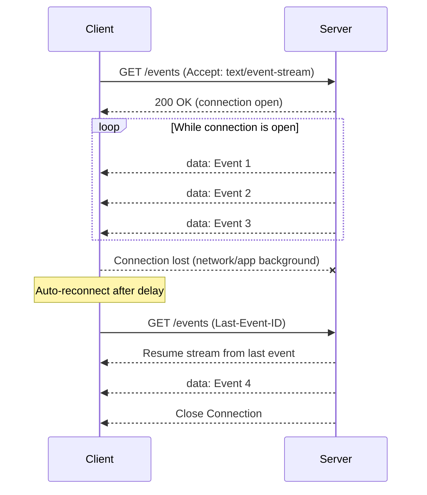

# Real-Time Connection Protocols: WebSockets and Server Sent Event 

> [!NOTE]
> Scope of this repository to build an experimental application to *learn by building* on ***real-time communication protocols***.

## Research

### What is WebSockets?

*WebSocket* is a persistant real-time communication protocol that provides full-dublex, low latency and event-driven connection between the server and the browser. By means of being full dublex, *WebSocket* has to ability to send and recieve data simultaneously between a client (e.g. web browser) and a server over a *single connection.* This behavior also mentioned as connection being *bidirectional*. 

Unlike HTTP, which operates in *request response model*, WebSockets enable persistent and continous data exchange. This means data is exchanged in real-time. Although this differs, both protocols operate on the **OSI MODEL**'s **Application Layer (layer7)** and rely on *TCP/IP* at the Transport Layer (layer 4). 

Similar to HTTP and HTTPs, WebSockets have a unique set of prefixes:
- **ws**: indicates an *unencrypted* connection without TLS 
- **wss**: indicates an *encrypted* connection secured by TLS.


#### How WebSocket Works?
 ```mermaid
    sequenceDiagram
        participant C as Client
        participant S as Server
        C->>S: Upgrade Request w/Upgrade Header
        Note over C,S: GET /chat HTTP/1.1<br/>HOST: example.com<br/>Upgrade: websocket<br/>Connection: Upgrade<br/>Sec-WebSocket-Key: xxx<br/>Sec-WebSocket-Versiion: 13
        S->>C: Handshake
        Note over S,C: 101 Switching Protocols<br/>Upgrade: Websockets<br/>Connection:Upgrade<br/>Sec-WebSocket-Accept: token
        S<<-->>C: Connection Established
 ```

WebSockets establish a persistent, bidirectional connection between the client and the server. The process begins with an HTTP handshake initiated by the client, where the client requests a WebSocket connection by sending a specific header to the server. If the server accepts the request, it responds with a status code 101 confirming the upgrade to a WebSocket connection.

Once the connection is established, the WebSocket protocol takes over, and both the client and the server can send and receive data at any time without the need for repeated handshakes. This continuous connection allows real-time communication with minimal latency, as data is exchanged immediately without waiting for additional requests.

The connection remains open until *either party* the client or the server decides to close it.

#### Advantages and Disadvantages of WebSocket Connections

In manner of advantages, websocket connections provides *bi-directional data exchange* and *low latency overhead* with introducing *reduced bandwidth usage* due to single connection requirement.

On the other hand, instrumenting websocketss can be complex, and there is no built-on security unlike HTTP.

#### WebSocket Usecases

- Chat Applications
- Online Gaming
- Real-Time Dashboards

### What is Server-Sent Events (SSE)?

Server Sent Events (SSE) is a technology that provides persistent and single directional data streaming from servers to clients. It functions similarly to WebSockets by using a single, long lived HTTP connection to deliver data in real-time.

SSE rely on two fundamental components:
- **EventSource:** An interface defined by the *WHATWG* specification and implemented by modern browsers. It enables the client (typically browsers) to subscribe to server-sent events
- **EventStream:** A protocol that specifies the plain-text format servers must use to send events, ensuring compatibility with the EventSource client for seamless communication.

SSE events have dedicated *MIME type* which is **text/event-stream**. A **MIME type** *(Multipurpose Internet Mail Extensions type)* is a standard that indicates the nature and format of a file or data, allowing the browser or server to properly interpret and handle it.

#### How Do SSE Work?

SSE work by establishing a persistent, one-way communication channel from the server to the client over a standard HTTP connection.

The client initiates the connection by creating an `EventSource` object, which sends a request to the server to start streaming data. Once the server receives this request, it responds by sending a continuous stream of updates in a specific *text/event-stream* format. The client listens for these events, automatically handling any re-connections if the connection is lost.

SSE is ideal for applications that require real-time updates from the server, such as live news feeds or notifications, as it ensures a constant flow of information with minimal overhead.

#### Advantages

- Polyfill Capability: Server-sent events can be implemented Javasciprt in browsers that do not support natively. This ensures backward compatibility by leveraging the standard SSE interface instead of creating a custom alternative
- Automatic Reconnection: SSE connections are designed to reconnect automatically after interruption. Thus, they reduce the need for extra code to handle this essential functionality.
- Firewall-friendly: SSEs work seamlessly with corporate firewalls that perform packet inspection, making them a reliable choice for enterprise applications.

#### Disadvantages
- **Data format restrictions**: SSE is restricted to transmitting messages in UTF-8 format, as it does not support binary data. 
- **Connection Limits**: Browsers cap the number of simultaneous SSE connections to **six per client**. This limitation becomes problematic when multiple tabs require active SSE connections. See [relative StackOverFlow thread](https://stackoverflow.com/questions/18584525/server-sent-events-and-browser-limits) for details and workarounds.
- **One way communication:** SSE supports only server-to-client messaging, making it ideal for read-only real-time applications like stock tickers. However, this unidirectional nature can be a constraint for more interactive real-time applications.


#### Usecases for SSE

Server Sent Events enables the servers to push updates to the clients automatically, making it ideal for applications that require live information streams. E.g. news feeds to financial dashboards, SSE ensures that users receive the latest content without page refreshes.

> [!INFO]
> Social media platforms leverage SSE to push new posts instantly, likes, and comments to users’ feeds, providing a more dynamic and engaging user experience. A great example is Twitter’s (X’s) real-time feed implementation, which allows them to push real-time updates to the browser. 


- Enterprise Monitoring Systems:
SSE enables financial monitoring systems and other real-time applications to deliver live data updates efficiently. For instance, Netflix’s open-source Hystrix, a well-known component for microservice monitoring and circuit breaking, includes a web dashboard that displays real-time performance metrics and circuit status. This dashboard uses SSE to push performance data in real-time, ensuring that users can monitor the health and performance of microservices as they happen. The dashboard leveraging SSE provides an efficient, low-latency solution for updating performance data without needing constant manual refreshing or polling.

- Generative AI
SSE technology plays a key role behind the scenes when interacting with Generative AI chatbots like ChatGPT and Gemini. For instance, when a user requests ChatGPT to write an article on a specific topic, the server starts processing the request and generates the article progressively, often in chunks rather than all at once.

During this process, ChatGPT’s server utilizes SSE to push each part of the article to the client in real-time, allowing the user to see the content appear as it is being generated.


## Project Overview

### Project Scope

Project will be covering WebSocket and SSE communication protocols from scratch. Lastly, on _phase 6_ third party integrations will be covered.

### Project Description

_Real-Time Collaboriton Board_ will be an application that users will be able to CRUD notes, and get notification in real-time.

### Tech-Stack

**Backend:** Go ^1.25.0 
**Frontend:**: Nextjs with AppRouter, Typescript and TailwindCSS 
**API Design:** WebSockets for bi-directional CRUD operations, SSE for notifications
**State Management:** In memory or redis
**Development Environment and Ops**: Git, Docker, Neovim

### Project Roadmap

In order to conduct clear educational steps to `learn by building` on _Real Time Communication Protocols_ following roadmap or phase plan will be used:

- [x] Phase 1 - Foundations
    - [x] 1.1 -> HTTP Server Skeleton with Golang
    - [x] 1.2 -> Frontend Project Skeleton with basic layout using NextJS framework with AppRouter, TypeScript and TailwindCSS

- [x] Phase 2 - Implementing Server Sent Events
    - [x] 2.1 -> SSE endpoint (Go)
    - [x] 2.2 -> SSE Client Instrumentation (Next.js)
    - [ ] 2.3 -> Presence System Implementation

- [ ] Phase 3 - WebSocket Implementation 
    - [ ] 3.1 -> WebSocket upgrade and connection manager on server side
    - [ ] 3.2 -> WebSocket client hook on frontend
    - [ ] 3.3 -> Board event protocol (message types, serializing/ deserializing messages)

- [ ] Phase 4 - Feature Implementation
    - [ ] 4.1 -> CRUD over WebSocket
    - [ ] 4.2 -> Optimistic UI & reconciliation

- [ ] Phase 5 - Production Hardening
    - [ ] 5.1 -> RReconnection and exponential backoff 
    - [ ] 5.2 -> Heartbeat / ping-pong mechanism
    - [ ] 5.3 -> Graceful shutdown on backend

- [ ] Phase 6 - Third party implementation strategies
    - [ ] 6.1 -> Refactoring the server api with `gorilla/websocket`
    - [ ] 6.2 -> EventSource polyfill and reconnecting-eventsource

## Versioning & Changelog

In order to implement _changes_, e.g. refactors or new features, in several steps this repository will use `Phase x.x.x` declaration. 

Thus to follow steps and further changes, please check [issues](https://github.com/ilkerciblak/socketoid/issues) and [CHANGELOG.md](./CHANGELOG.md) 

