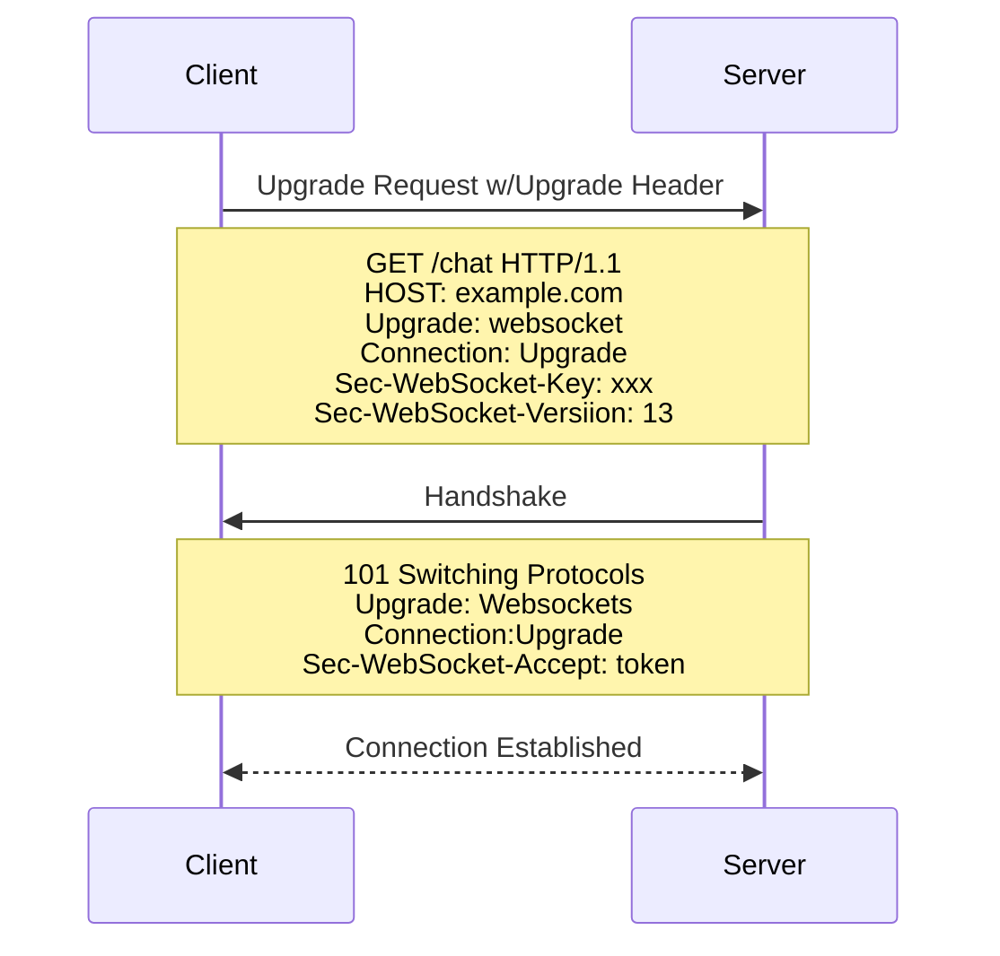

# Issue#10 - Presence System Instrumentation [See on GitHub repository](https://github.com/ilkerciblak/socketoid/issues/10)

## Overview

Real time communication protocols referes to continous exchange of data with minimal latency. Unlike traditional request-response model where _data exchange happens on demand_, live updates happens w/o requirement of refreshing UI.

The WebSocket Protocol is a real-time communication protocol that provides bi-directional data exchange, mostly this behavior called full-dublex communication, over persistent single TCP connection between client and the server.

Connection protocol consists of three phases, _opening an upgrade request_, _server responds with `101 Switching Protocols` then \_establishing the connection_. This preparation also called the **handshake process**.



Similar to HTTP and HTTPs, WebSockets have a unique set of prefixes:

- **ws**: indicates an _unencrypted_ connection without TLS
- **wss**: indicates an _encrypted_ connection secured by TLS.

While introducing less latency on data exchange and minimal overhead, it is mostly used in live-data exchange systems like chatting apps, online gaming and dashboards.

## Research and Planning

### Exploring Handshake

The _handshake_ process is the bridge from HTTP to WebSockets. In the handshake, details of the connection are negotiated, and either party can back out before completion if the terms are unfavorable.

The server must be careful to understand everything the client asks for in order to maintain secure connection and data exchange.

> [!WARNING]
> **PORTS**: The server may listen on any port it chooses. However if it choosen any port rather than `80 or 443`, it may raise problems with _firewalls and proxies_.

**1. Initiating the handshake process, Client**

Every case, a client must start the _websocket handshake_ process by contacting the server and _requesting a websocket connection_.

The client will send a pretty standard HTTP request with required socket `HEADERS`, - the HTTP version must be 1.1 or greater - HTTP method must be `GET`

```HTTP
GET /chat HTTP/1.1
Host: example.com:8000
Upgrade: websocket
Connection: Upgrade
Sec-WebSocket-Key: dGhlIHNhbXBsZSBub25jZQ==
Sec-WebSocket-Version: 13
```

In addition, the client can define [extension](###) and/or [subprotocol](###) headers.

> [!NOTE]
> **Origin Header:** All browsers send an `Origin` header. It can be used for security manners. This is effective against [Cross site WebSocket Hijacking(CSWH)](https://cwe.mitre.org/data/definitions/1385.html). Most applications reject requests without this header.

> [!NOTE]
> **Status Codes**: Regular HTTP status codes can be used **only before the handshake**. Use different set of codes after handshake process succession. See [RFC Documentation](https://www.rfc-editor.org/rfc/rfc6455#section-7.4)

### Server handshake response

When a **server** recieves a handshake request, it should respond with indicating that the protocol will be changing from HTTP to WebSocket.

```HTTP
HTTP/1.1 101 Switching Protocols
Upgrade: websocket
Connection: Upgrade
Sec-WebSocket-Accept: s3pPLMBiTxaQ9kYGzzhZRbK+xOo=
```

The `Sec-WebSocket-Accept` header is important that the server must derive it from the client's request's `Sec-WebSocket-Key` header. Generation procedure: - Concatenate the client's `Sec-WebSocket-Key` and the [magic string](https://en.wikipedia.org/wiki/Magic_string) `258EAFA5-E914-47DA-95CA-C5AB0DC85B11`. - Hash the concatenated string with `SHA-1` - return hashed string in `base64Encoded` form in `Sec-WebSocket-Accept` header.

> [!WARNING]
> Magic string is a thing, look for it.

> [!NOTE]
> The server can send other headers like Set-Cookie, or ask for authentication or redirects via other status codes, before sending the reply handshake.

Additionally the server can decide on extension/subprotocol requets here. See [MDN WebSocket Documentation](https://developer.mozilla.org/en-US/docs/Web/API/WebSockets_API/Writing_WebSocket_servers#miscellaneous) _Miscellaneous_ part.

### Exchanging Data Frames

Using _websockets_ either the client or the server can send a message at any time. This message/data is transmitted using _a sequence of `frames`_. A client **must** mask all frames that it sends to the server **whether or not the communication is over TLS**. The server **MUST NOT** mask any frames that it sends to the client. Consequently, in order to communicate securely: - A client **must close** the connection upon **receiving a MASKED frame** with **a status code `1002 (protocol error)`**

- Similarly a server **must close** the connection upon **receiving a NOT masked framed** with **a status code `1002 (protocol error)`**

> [!NOTE]
> These rules might be relaxed in a future specification, says [RFC WS Spec](https://www.ref-editor.org/rfc/rfc6455#section-5)

A dataframe **MAY** be transmitted by either the client or the server at any time after opening handshake completion and before that endpoint has sent a **CLOSE frame**. See [RFC WS SPEC - Section 5.5.1](https://www.rfc-editor.org/rfc/rfc6455#section-5.5.1)

The base framing protocol defines a frame type with an opcode, a payload length, and designated locations for "Extension data" and "Application data", which together define the "Payload data". Certain bits and opcodes are reserved for future expansion of the protocol.

### Base Framing Protocol

Having to say that, all frames follow the same specific format. Data going from the client to the server is **masked** using [XOR encryption](https://en.wikipedia.org/wiki/XOR_cipher)(with a 32-bit key). See [RFC WS SPEC - Section 5](https://www.ref-editor.org/rfc/rfc6455#section-5) for full description.

```yaml
Data frame from the client to server (message length 0–125):

 0                   1                   2                   3
 0 1 2 3 4 5 6 7 8 9 0 1 2 3 4 5 6 7 8 9 0 1 2 3 4 5 6 7 8 9 0 1
+-+-+-+-+-------+-+-------------+-------------------------------+
|F|R|R|R| opcode|M| Payload len |          Masking-key          |
|I|S|S|S|  (4)  |A|     (7)     |             (32)              |
|N|V|V|V|       |S|             |                               |
| |1|2|3|       |K|             |                               |
+-+-+-+-+-------+-+-------------+-------------------------------+
|    Masking-key (continued)    |          Payload Data         |
+-------------------------------- - - - - - - - - - - - - - - - +
:                     Payload Data continued ...                :
+ - - - - - - - - - - - - - - - - - - - - - - - - - - - - - - - +
|                     Payload Data continued ...                |
+---------------------------------------------------------------+

Data frame from the client to server (16-bit message length):

 0                   1                   2                   3
 0 1 2 3 4 5 6 7 8 9 0 1 2 3 4 5 6 7 8 9 0 1 2 3 4 5 6 7 8 9 0 1
+-+-+-+-+-------+-+-------------+-------------------------------+
|F|R|R|R| opcode|M| Payload len |    Extended payload length    |
|I|S|S|S|  (4)  |A|     (7)     |             (16)              |
|N|V|V|V|       |S|   (== 126)  |                               |
| |1|2|3|       |K|             |                               |
+-+-+-+-+-------+-+-------------+-------------------------------+
|                          Masking-key                          |
+---------------------------------------------------------------+
:                          Payload Data                         :
+ - - - - - - - - - - - - - - - - - - - - - - - - - - - - - - - +
|                     Payload Data continued ...                |
+---------------------------------------------------------------+

Data frame from the server to client (64-bit payload length):
 0                   1                   2                   3
 0 1 2 3 4 5 6 7 8 9 0 1 2 3 4 5 6 7 8 9 0 1 2 3 4 5 6 7 8 9 0 1
+-+-+-+-+-------+-+-------------+-------------------------------+
|F|R|R|R| opcode|M| Payload len |    Extended payload length    |
|I|S|S|S|  (4)  |A|     (7)     |             (64)              |
|N|V|V|V|       |S|   (== 127)  |                               |
| |1|2|3|       |K|             |                               |
+-+-+-+-+-------+-+-------------+ - - - - - - - - - - - - - - - +
|               Extended payload length continued               |
+ - - - - - - - - - - - - - - - +-------------------------------+
|                               |          Masking-key          |
+-------------------------------+-------------------------------+
|    Masking-key (continued)    |          Payload Data         |
+-------------------------------- - - - - - - - - - - - - - - - +
:                     Payload Data continued ...                :
+ - - - - - - - - - - - - - - - - - - - - - - - - - - - - - - - +
|                     Payload Data continued ...                |
+---------------------------------------------------------------+
```

- First Byte:
  - **FIN:** indicates whether that is the _final fragment_ in a message. The first fragment may also be the final fragment. If it is `0` then the server keeps listening for more parts of the message. On the other hand if it is not, server should consider the message delivered to interpret what to do.
  - **Bits 1-3, RSV1 & RSV2 & RSV3:** Indicating the extensions. They **MUST** be `0` unless an extension is negoriated that defines meanings for non-zero values. Otherwise, the receiving endpoint **MUST** _fail the websocket connection_.
  - **Bits 4-7, OPCODE:** Defines how to interpret the payload data. If an unknown opcode is received, the receiving endpoint **MUST** fail the websocket connection.
    - `0x0`: denotes frame continuation
    - `0x1`: denotes text, which is always encoded in `UTF-8`
    - `0x2`: denotes a binary frame
    - `0x8`: denotes a connection close
    - `0x3 to 0x7`: are reserved for further _non-control frames_
    - `0x9`: denotes a ping
    - `0xA`: denotes a pong
    - `0xB-F` are reserved for further _control frames_. See [RFC WS Spec - Control Frames](https://www.rfc-editor.org/rfc/rfc6455#section-5.5.1)

- **Bit 8, MASK:** indicates whether the `Payload data` is _masked or not_. Besides client messages **must** be always masked, if it is set to `1`, _a masking key_ should be present in message in order to decode the message on server side.
- **Bits 9-15, Payload Length:** Denotes the payload length in bytes 7 bits, 7+16 or 7+64 bits. See [Decoding Payload Length Section][### Decoding Payload Length] for further information
- **Masking-Key: 0 to 4 bytes:** All frames sent from the client to the server are masked by a 32-bit value that is contained within the frame. This field is present if the mask bit is set to 1 and is absent of the mask bit iis set to 0. See [RFC WS SPEC - Section 5.3](https://www.rfc-editor.org/rfc/rfc6455#section-5.3) for further details on _client-to-server masking._
- All subsequent bytes are **payload** .

### Decoding Payload Length and Reading Data

The `Payload Data` is defined as the concatenated data of `Extension data` and `Application Data`. The base framing protocol is formally defined by the following ABNF [RFC5234](https://www.rfc-editor.org/rfc/rfc5234). 
> [!IMPORTANT]
> It is important to note that the representation of this data is **binary**, not ASCII characters.

#### Decoding Payload Length

Follow this guideline:
- Read bits 9-15 inclusively, and interpret that as an *unsigned integer* . If it is 125 or less, then that's the payload length. If it s 126 go to the step 2. It if it is 127 go to the step 3.
- If **payload length** is **126**, read the next **16 bits** and interpret those as an unsigned integer.
- If **payload length** is **127** read the next **64 bits** and interpret those as an unsigned integer. The most significant bit must be `0`.

#### Reading and unmasking the data

Considering as the data is masked, read the next **4 octets / 32 bytes**  (octect is always 8 bits); this is the **masking key**. Once the payload length and masking key is decoded, read the corresponding payload length of bytes from the socket.

Let's call the data `ENCODED`, and the mask key as `MASK`. In order to get `DECODED`, loop through the **octets of**  `ENCODED` and **XOR** the octet with the 4th octet of `MASK`. See the javascript code as an example
```js

// The function receives the frame as a Uint8Array.
// firstIndexAfterPayloadLength is the index of the first byte
// after the payload length, so it can be 2, 4, or 10.
function getPayloadDecoded(frame, firstIndexAfterPayloadLength) {
  const mask = frame.slice(
    firstIndexAfterPayloadLength,
    firstIndexAfterPayloadLength + 4,
  );
  const encodedPayload = frame.slice(firstIndexAfterPayloadLength + 4);
  // XOR each 4-byte sequence in the payload with the bitmask
  const decodedPayload = encodedPayload.map((byte, i) => byte ^ mask[i % 4]);
  return decodedPayload;
}

const frame = Uint8Array.from([
  // FIN=1, RSV1-3=0, opcode=0x1 (text)
  0b10000001,
  // MASK=1, payload length=5
  0b10000101,
  // 4-byte mask
  1, 2, 3, 4,
  // 5-byte payload
  105, 103, 111, 104, 110,
]);

// Assume you got the number 2 from properly decoding the payload length
const decoded = getPayloadDecoded(frame, 2);

console.log(new TextDecoder().decode(decoded)); // "hello"

```

> [!NOTE]
> Masking is a security measure to avoid malicious parties from predicting the data that is sent to the server. The client will **generate a cryptographically random masking key for each message** 


### Message Fragmentation

The primary purpose of _fragmentation_ is to allow sending a message that is of **unknown size** when the message is started without having to buffer that message. 

If messages could not be fragmented, then an server endpoint would have to **buffer the entire message**  so its length could be counted before the first byte is sent. With fragmentation, a server or intermediary may choose a reasonable size buffer and, when the buffer is full, write a fragment to the network. See [RFC WS Spec - Section 5.4 Fragmentation](https://www.rfc-editor.org/rfc/rfc6455#section-5.4) for further usecases and rules.

```
Client: FIN=1, opcode=0x1, msg="hello"
Server: (process complete message immediately) Hi.
Client: FIN=0, opcode=0x1, msg="and a"
Server: (listening, new message containing text started)
Client: FIN=0, opcode=0x0, msg="happy new"
Server: (listening, payload concatenated to previous message)
Client: FIN=1, opcode=0x0, msg="year!"
Server: (process complete message) Happy new year to you too!
```

The `FIN` and `OPCODE` fields work together to send a message split up into seperate frames. Fragmentation is **only available for opcodes** `0x0` to `0x2`.

> [!IMPORTANT]
> The `OPCODE` denotes what a frame is meant to do. If it is `0x0` the frame i a continuation frame; this means the server should concatenate the frame's payload to the last frame it received from the client.

 Notice the first frame contains an entire message (has FIN=1 and opcode!=0x0), so the server can process or respond as it sees fit. The second frame sent by the client has a text payload (opcode=0x1), but the entire message has not arrived yet (FIN=0). All remaining parts of that message are sent with continuation frames (opcode=0x0), and the final frame of the message is marked by FIN=1.

### Control Frames

Control frames are used to communicate state about the websocket. They can be injected in the middle of a fragmented message.

> [!NOTE]
> All control frames **MUST** have a payload length of **125 bytes or less** and **MUST NOT** be fragmented.  

Control frames can be declared using `OPCODE` part. Currently defined _OPCODES_ for control frames includes `0x8` for `CLOSE`, `0x9` for `PING` and `0xA` for `PONG`. 

#### CLOSE, Closing the connection

To close a connection either party client or the server can send a control frame with data containing a specifid control sequence to begin the closing handshake. Upon receiving such a frame, the other party sends a `CLOSE` frame in response. The first party then closes the connection. Any further data recieved after closing is then discarded.

- Close frames sent from client to server **must** be masked again.
- The `CLOSE` frame **MAY** contain a **body**  (the `Application Data` portion of the frame) that indicates **a reason for closing.**
    - The first two bytes of the body **MUST** be a 2-byte unsigned integer representing a status code with value /code/ defined in [RFC WS Spec - Section 7.4. Status Codes](https://www.rfc-editor.org/rfc/rfc6455#section-7.4). 
    - Following the 2-byte integer, the body **MAY** contain `UTF-8-encoded` /reason/ data. Clients **MUST NOT** show it to end user. See [RFC WS Spec - Section 5.5.1 Close](https://www.rfc-editor.org/rfc/rfc6455#section-5.5.1) for further information.  

#### Ping and Pongs

At any point after the handshake, either the client or the server can choose to send a ping to the other party. When the ping is received, the recipient must send back a pong as soon as possible. This mechanism generally used for health checks.

When server get a `PING`, it send back a `PONG` with the exact same `PAYLOAD DATA` as the ping. Either party might also get a `PONG` without ever sending a `PING`, it should be ignored.

> [!IMPORTANT]
> For both `PING` and `PONG`, the max payload length is 125 bytes.

## Implementation Notes


### Initiating WebSocket Connection
As mentioned, websocket connection starts with a couple of HTTP requests that constructing `handshake process`. 

First *client party* initiates the handshake process with a HTTP requests similar to following:
```HTTP
GET /ws-endpoint HTTP/1.1
Host: example.com:PORT
Upgrade: websocket
Connection: Upgrade
Sec-WebSocket-Key: some-key
Sec-WebSocket-Version: 13
```
On server party, handler should examine this request and upgrade the connection to `websocket`. While this process, server party should _compute_ the `Sec-WebSocket-Accept` header value through `Sec-WebSocket-Key` header value which _client_ sent. If server supports `websocket` connection, server should respond with `101 Switching Protocol`:
```HTTP
HTTP/1.1 101 Switching Protocol
Upgrade: websocket
Connection: Upgrade
Sec-WebSocket-Accept: <computed-accept-header>
```

#### How to Generate Accept Key on Server Side ,`Sec-WebSocket-Accept` 

Accept Key generation process involves, 

- Retrieving hashed `Sec-WebSocket-Key` value from the  `request headers`
- Concatenating raw `Sec-WebSocket-Key` with the `magic-string` **258EAFA5-E914-47DA-95CA-C5AB0DC85B11** as `Sec-WebSocket-Key+magic-string` 
- Hashing the resulting string with `SHA-1` chipher.
- Base64 encoding the hashed string. Resultant base64Encoded string is the `Sec-WebSocket-Accept` value.

This `header` ensures and checks whether the issuer client requested `websocket` connection.


#### Using TCP Connection

After the handshake procedure is done with `101 Switching Protocol` respond, the `http.ResponseWriter` cannot be used no more. In order to exchange data in real time using `websockets`, application is required to use raw TCP connection via `net.Conn`.

Thus in websocket connection handler, `http.Hijacker` interferface is used to construct TCP connection.

```go
hijacker, k := w.(http.Hijacker)
conn, buffread, err := hijacker.Hijack()
```

`Hijack()` gains the control of the HTTP server and returns `net.Conn` interface instance. We can read `data-frames` over this `conn` from now on.

#### Instrumenting WebSocket Upgrade Handler 


Similar to _SSE_ part of this project, a `Hub` instance will orchestrate `Client`s and their connections.  

Following code demonstrate the **accept key generation** and **response construction** private functions.   

```go
package ws

import (
	"crypto/sha1"
	"encoding/base64"
	"fmt"
	"net/http"
	"strings"
)

type websocket struct {
	host string
	port string
	h    *hub
}

const magicString string = "258EAFA5-E914-47DA-95CA-C5AB0DC85B11"

func generateAcceptKey(clientKey string) string {
	// Concatenate with magic string
	clientKey = clientKey + magicString
	// Hash the result using SHA-1
	hasher := sha1.New()
	hasher.Write([]byte(clientKey))
	// Encoding and creating Sec-WebSocket-Accept Header
	hashed := base64.StdEncoding.EncodeToString(hasher.Sum(nil))
	return hashed
}

func handshakeResponse(acceptHeader string) []byte {
	lines := []string{
		fmt.Sprintf("HTTP/1.1 %d %s", http.StatusSwitchingProtocols,http.StatusText(http.StatusSwitchingProtocols)),
		fmt.Sprintf("Sec-WebSocket-Accept: %s", acceptHeader),
		"Upgrade: websocket",
		"Connection: Upgrade",
		"",
	}

	return []byte(strings.Join(lines, "\r\n"))
}
```

After _hijacking_ the connection in order to use _raw TCP connection_, `http.ResponseWriter` is able to be used. Instead application should `read/write` bytes of data over connection buffer. Also [RFC Documentation](https://www.rfc-editor.org/rfc/rfc6455) states every line of the respond should include`\r\n` and an extra `\r\n` after the respond headers. 

```go
func (ws *websocket) Upgrade(w http.ResponseWriter, r *http.Request) {

	hijacker, k := w.(http.Hijacker)
	if !k {
		http.Error(w, "websocket connection is not supported", http.StatusInternalServerError)
		return
	}

	conn, buffRW, err := hijacker.Hijack()
	if err != nil {
		http.Error(w, err.Error(), http.StatusInternalServerError)
		return
	}
	client := NewClient(conn)

	// Read Sec-WebSocket-Key from request headers
	key := r.Header.Get("Sec-WebSocket-Key")

	// Generate Sec-WebSocket-Accept header value
	acceptHeader := generateAcceptKey(key)
	data := handshakeResponse(acceptHeader)
	buffRW.Write(data)

	buffRW.Flush()

	ws.h.register <- client

}
```
`Upgrade` handler, first `Hijack()` the HTTP connection to retrieve `net.Conn` interface instance and a `bufio.ReadWriter` instance. Returns a `500 Internal Server Error` whether the `http.Hijacker` interface is not supported.


After that, in order to manage client connection on `Client` instance, it creates a new client and completes the `handshake` process with generating `accept-key` and using `bufio.ReadWriter.Flush()`. Finally sending the new created client instance to `hub`'s register channel.


### Reading and Decoding Data Frames


## Implementation Decisions

## Related ADRs

## References

- https://www.rfc-editor.org/rfc/rfc6455
- https://developer.mozilla.org/en-US/docs/Web/API/WebSockets_API/Writing_WebSocket_servers
