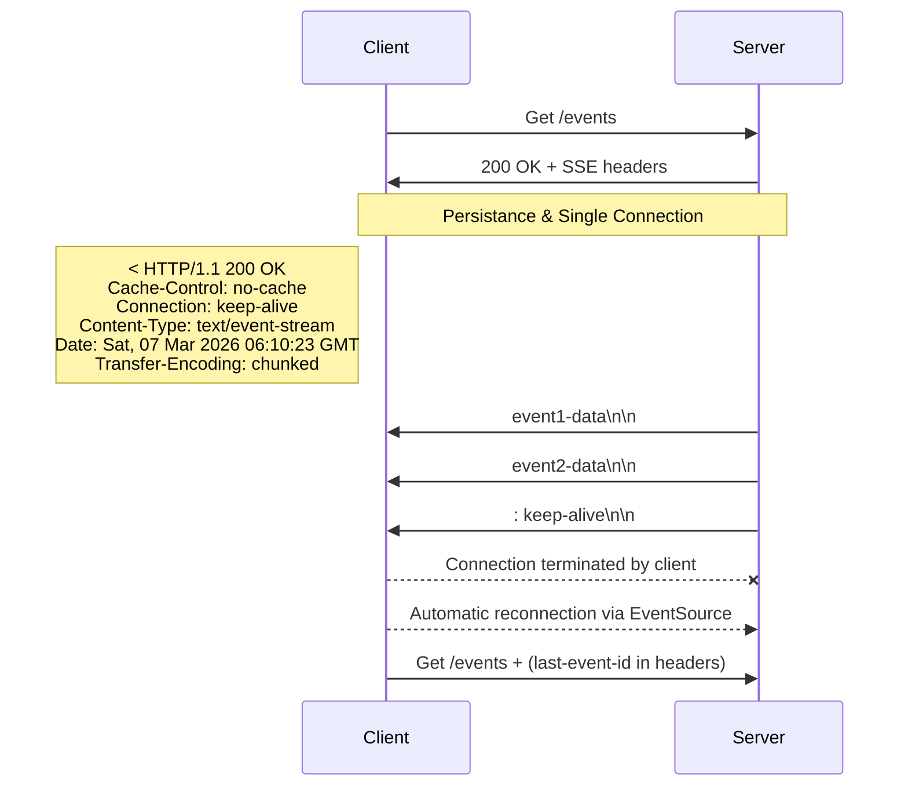
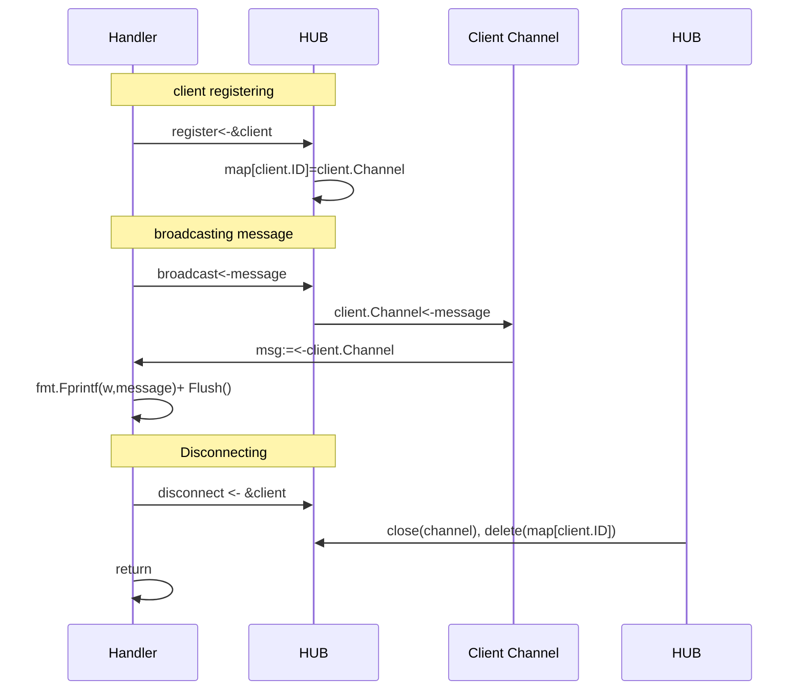

# [Issue #5](https://github.com/ilkerciblak/socketoid/issues/5) SSE Endpoint — Server-Sent Events Backend Implementation

## What is SSE and How it Works

> [!NOTE]
> This documentation will serve summarized information over SSE, see the [main research on SSE](../rd/server_sent_events.md)

_Server Sent Event_ is a communication pattern that provides uni-directional real-time communication over persistence single HTTP/HTTPs connection. Using SSE, servers can push data to clients. For example, on live dashboard systems, live monitoring systems _server sent events_ mostly used since only live data flow from server to client is required. On the other hand on Generate AI systems, server sent event is used to send each response part as it is generated instead of pushing _chunked_ answer when user gives a prompt. 

Although there are alternative ways to determine real-time communication between client and server, as _websockets_ and _polling_, server sent events might be the best solution for given unidirectional examples. Despite _websockets_ provides less resource overhead and bi-directional communication, it introduces more development complexity and some user-agents might not have ability to support this feature. On the other hand, pooling is just _mimicking_ real time communication with frequent http api calls. Thus it introduces much resource consumption.

### How SSE works at HTTP level

#### Required Headers

Given three(3) headers are set when client calls an _SSE_ endpoint:

- `Content-Type: text/event-stream`: The server-side script that sends events needs to respond using the MIME type text/event-stream. Each notification is sent as a block of text terminated by a pair of newlines. For details on the format of the event stream.[Quoted MDN Documents](https://developer.mozilla.org/en-US/docs/Web/API/Server-sent_events/Using_server-sent_events)
- `Cache-Control: no-cache`: Responses must not to be cached in order to serve real-time data.
- `Connection: keep-alive`: TCP connection must be persistance on single instance for all event stream.

#### Wire Format
Server sent event response has its own format.[(See examples)](../../README.md###Fields). For example, to present text, named events with data and comment see below:

```bash
data: hello
```
```bash
event: user-joined\n
data: {"user-id": 1237741923}\n\n
```
```bash
: this-is-a-comment\n\n
```

some followups:
- `\n\n`: declares the end of a event data
- `\n`: declares event data continous with a new line
- `:` starting messages: corresponds to comments, mostly used for `keep-alive` messages
- if there is an `event` field in a message, client js should use `addEventListener('event-name')` instead of `onmessage`. ([See EventSource](https://developer.mozilla.org/en-US/docs/Web/API/EventSource))


#### Connection Lifecycle



## Implementation Problems, Decisions and Details

## The Scale Problem

By default behavior of _go-lang concurrency rules_, every _goroutine_ is running isolated. Thus there is no shared memory. On the other hand, each time a client connects to the sse endpoint, a new isolated go routine is running for this client. #X number of clients means #X of isolated go-routines running background.

This behavior complicates centerilized management of these multiple client connections. Also any event may require to broadcast its data to multiple user at once. Consequently, application requires a centerilized connection manager that is aware of registering, disconnection clients and can broadcast message to all or filtered client message channels.

### Hub Pattern

```
Client A ──┐
Client B ──┤──► HUB ◄── broadcast("some event")
Client C ──┘
```

[Hub](../../backend/internal/api/sse/hub.go) is the central orchestrator that operates client connections. All client registerations, disconnections and message broadcasting operations will be running over hub. It holds the information of connection clients and their message channels. Also it encapsulates the registeration, disconnection and message broadcasting methods.

```go
    type hub struct {
    	mu          *sync.Mutex
    	connections map[string]chan string
register    chan *Client
    	disconnect  chan *Client
    	broadcast   chan string
    }
```

Although `Hub` encapsulates registering, disconnection and message distribution mechanisms other layers (e.g. sse handlers) will not use these methods. Using these methods will result `race conditions`.Instead all actions will flow on hub's channels.

For example, hub pushes a new message to broadcast channel, client reads its own message and writes this message to its `ResponseWriter`.

Also in order to prevent `deadlocks` `Hub` orchestractor has its own go-routine to sort and process operations

```go
func (h *hub) Run(ctx context.Context) {
	fmt.Println("sse server running")

	for {
		select {
		case <-ctx.Done():
			return
		case new_client := <-h.register:
			if err := h.registerClient(*new_client); err != nil {
				fmt.Println(err)
			}
		case client := <-h.disconnect:
			h.disconnectClient(client.ID)
		case msg := <-h.broadcast:
			h.broadcastMessage(msg)
		}
	}
}
```
Given `select loop` orchestrates and processing in-coming operations in sorted manner to prevent `deadlocks`. At entry point of the application it requires to run `go hub.Run(ctx)`.


#### Register/ Disconnect/ Message Broadcast flow with mermaid diagrams




